  

   

  <strong>Software Engineering student and independent developer building practical software for real workflows.</strong>
   
  Desktop applications, operational platforms, automation, and specialized developer tools.

    

  
  
  

---

## About me

I'm **Igor Santana**, a developer who enjoys turning complicated routines into software that feels clear and useful. My projects move between business applications, desktop tools, automation, and visual editors, but the goal is usually the same: understand the real workflow, model it well, and remove unnecessary friction.

I am currently studying **Software Engineering** and growing through hands-on projects. I care about readable code, sensible architecture, performance, and interfaces that help people make decisions instead of giving them more work to do.

What best describes me is not a single framework. I am a **product-minded application developer** who is comfortable crossing boundaries when a problem calls for it, from a TypeScript dashboard to a shared .NET domain engine or a custom parser and canvas in Python/C++.

<table>
  <tr>
    <td width="25%" valign="top">
      <strong>Operational software</strong>  
      Dashboards, fleet management, KPIs, financial and inventory workflows.
    </td>
    <td width="25%" valign="top">
      <strong>Desktop applications</strong>  
      WPF, Electron, Qt, local persistence, and cross-interface domain logic.
    </td>
    <td width="25%" valign="top">
      <strong>Automation</strong>  
      Python workflows, browser automation, integrations, structured logging, and concurrency.
    </td>
    <td width="25%" valign="top">
      <strong>Specialized tooling</strong>  
      Visual editors, parsers, resource resolution, and tools for technical communities.
    </td>
  </tr>
</table>

## Selected product work

### [Fleet Management ERP](https://github.com/lehnox/Gestao-Logistica.ERP)

A fleet operations platform designed around the decisions that managers make every day: fuel consumption, maintenance costs, vehicle performance, driver rankings, team structure, and route planning. The project combines a responsive React interface with desktop packaging through Electron and a mobile path through Capacitor.

`TypeScript` `React` `Electron` `Capacitor` `Recharts` `SQLite` `Google Maps`

### [SportXP](https://github.com/lehnox/SportXP)

A workout tracking application that turns training into a progression system with XP, ELO, streaks, missions, rankings, and history. Its most important engineering choice is a shared domain layer: the WPF desktop client and Blazor web app use the same rules and persistence model instead of duplicating business logic.

`C#` `.NET 8/9` `WPF` `Blazor` `MVVM` `LiveCharts2` `JSON`

### [Business Management UI](https://github.com/lehnox/Basic-ecommerce)

A frontend prototype for an integrated management platform covering inventory, finance, sales, services, production, reporting, and multi-company navigation. It explores how a broad operational system can remain understandable even when the number of modules grows.

`TypeScript` `React` `React Router` `Tailwind CSS` `Vite`

### [KPI Dashboard](https://github.com/lehnox/KPI-Dashboard)

A focused analytics interface for monitoring key indicators through reusable cards and line, bar, area, and pie charts. It is a compact example of component-driven UI work, typed data models, and responsive information design.

`TypeScript` `React` `Recharts` `Tailwind CSS` `Vite`

## Game development as Lehnox

**Lehnox** is the name I use specifically for my game-development work, especially within the **OpenTibia, OTClient, and Tibia tooling ecosystem**. This is where I work closest to rendering, custom file formats, modding workflows, and the small technical details that make community tools genuinely useful.

<table>
  <tr>
    <td width="50%" valign="top">
      <h3><a href="https://github.com/lehnox/Otui-Editor---Tibia">OTUI Editor for Tibia</a></h3>
      

        A visual editor for OTUI and OTMD files built with Python and PySide6. It includes a graphics canvas, hierarchy-aware parsing, live property editing, resource discovery, image browsing, grid snapping, zoom, pan, undo/redo, and serialization back to the original format.
      

      <code>Python</code> <code>PySide6</code> <code>Qt Graphics View</code> <code>Parsing</code>
    </td>
    <td width="50%" valign="top">
      <h3><a href="https://github.com/lehnox/OtuiEditorQT">OTUI Editor Qt</a></h3>
      

        A C++/Qt evolution of an existing community editor, expanded with fixes and a richer editing workflow. Its scope includes OTUI parsing, OpenGL/QPainter rendering, anchors, layouts, visual states, history, resource resolution, autosave, and formatted export.
      

      <code>C++</code> <code>Qt</code> <code>OpenGL</code> <code>QPainter</code>
    </td>
  </tr>
</table>

## Technology, chosen by purpose

I prefer to describe technology by what it helps me build, rather than treating a stack as an identity.

<table>
  <tr>
    <td width="25%" align="center" valign="top">
      <strong>Languages</strong>  
      
    </td>
    <td width="25%" align="center" valign="top">
      <strong>Web and product UI</strong>  
      
    </td>
    <td width="25%" align="center" valign="top">
      <strong>Desktop and data</strong>  
      
    </td>
    <td width="25%" align="center" valign="top">
      <strong>Daily workflow</strong>  
      
    </td>
  </tr>
</table>

## How I approach engineering

- **Start with the domain.** I want to understand the rule, constraint, or decision behind a feature before choosing its implementation.
- **Keep business logic portable.** Shared cores, typed models, and explicit boundaries make it easier to support more than one interface without multiplying bugs.
- **Make complexity visible and manageable.** Good tooling should help people work with a complex format or process without hiding the important parts.
- **Optimize for the next change.** Clear structure, maintainable code, and useful documentation matter because real software rarely stops at version one.
- **Treat performance and reliability as product features.** Fast feedback, predictable state, validation, and graceful failure all shape the user experience.

## Current direction

Right now, I am deepening my work in backend architecture, API design, testing, observability, CI/CD, and AI-assisted systems. I am particularly interested in connecting reliable application engineering with agents and automation without losing clarity, control, or maintainability.

## GitHub at a glance

  

  
  

These cards update from public GitHub activity. The language view excludes forked repositories so that large upstream codebases do not distort the picture.

  

  

  <picture>
    <source media="(prefers-color-scheme: dark)" srcset="https://raw.githubusercontent.com/lehnox/Lehnox/output/github-contribution-grid-snake-dark.svg" />
    <source media="(prefers-color-scheme: light)" srcset="https://raw.githubusercontent.com/lehnox/Lehnox/output/github-contribution-grid-snake.svg" />
    
  </picture>

---

  <strong>Good software should make the work clearer, not merely move the complexity somewhere else.</strong>
    
  Open to freelance projects, technical partnerships, and conversations about useful software.
    
  

